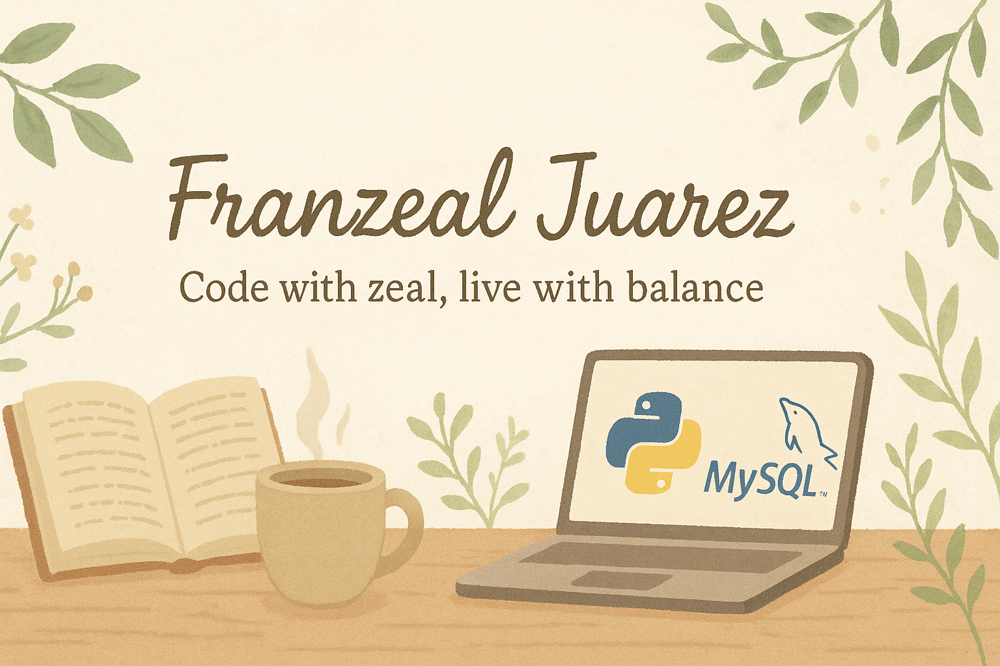

  

 
 #
 👋 Hi, I'm Franzeal Juarez  
📚 4th Year *BSIT* student at *MSU-IIT*  
🌐 Facebook: [Franzeal Juarez](https://www.facebook.com/FranzealJuarez)  
📧 Email: *franzeal.juarez@g.msuiit.edu.ph*  
😃 Personality: Ambivert  

### 🌱 About Me  
Like my name Franzeal, I believe life is a journey of finding zeal — passion that drives us forward despite challenges. Each step is about balancing reason and heart, solitude and connection, until we create a meaningful path of our own.

### 🛠️ Tools I've Used for 4 Years in College  

  
  
  
  
  

<!---

### 📊 GitHub Stats  

  
  

✨ “Code with zeal, live with balance.”
